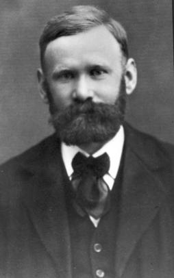

## Немного истории

Предыстория -- начало ХХ века
Детство     -- 1985-1991
Взросление  -- 1991-1998
Выход в мир -- с 1998 по настоящее время

### Предыстория -- начало ХХ века

Агнер Краруп Эрланг

https://en.wikipedia.org/wiki/Agner_Krarup_Erlang

Датский математик, статистик и инженер.
Основатель научного направления по изучению трафика в телекоммуникационных системах.
Автор теории массового обслуживания.

Теория массового обслуживания (теория очередей)
Queueing theory
https://en.wikipedia.org/wiki/Queueing_theory

1909
научная работа
«Теория вероятностей и телефонные разговоры»
(The Theory of Probabilities and Telephone Conversations)
Признана во всем мире, принята для использования в крупнейшей почтовой службе мира — Главном почтампе Великобритании.

В его честь была названа единица измерения трафика в телекоммуникационных системах — эрланг.
Его теория до сих пор используются при расчётах пропускной способности современных телекоммуникационных сетей.
И не только телекоммуникационных, а любых сетей.
А также для оценки автомобильного траффика, при проектировании дорог.
А также при проектировании фабрик, складов, магазинов и больниц.

### Детство -- 1985-1991

Эрланг родился в недрах шведской компании Эрикссон (Ericsson) -- крупного поставщика телекомуникационного оборудования и услуг.

Сложная индустрия: сложное оборудование, сложный софт, большой траффик, жесткие требования по доступности сервиса.
Это был highload тех времен.

В компании был отдел, занимающийся научной работой:
Ericsson’s Computer Science Laboratory in Stockholm, Sweden.

Джо Армстронг (Joe Armstrong),
Роберт Вирдинг (Robert Virding)
и Майк Вильямс (Mike Williams)
под руководством Бьярне Деккера (Bjarne Däcker)

Отделу была поставлена задача найти более эффективные средства разработки софта для железа и сервисов компании.
У компании уже был опыт разработки языков программирования,
использовались собственные проприетарные языки PLEX и EriPascal.
Но они не стремились разработать еще один язык, а хотели найти подходящее решение среди уже существующих.

В течение 2х лет отдел писал прототипы телеком-приложений на разных языках, имеющихся в то время:
- функциональные языки ML и Miranda
- многопоточные языки ADA, Modula и Chill
- Prolog
- Smalltalk

Больше всего им понравился Prolog. И первая виртуальная машина для Erlang была написана на нем.

Но разработчики пришли к выводу, что ни один язык не имеет нужного набора возможностей.
И главная проблема -- ни один язык не поддерживает многопоточность на нужном уровне.
И только через 2 года лаборатория решила разработать свой язык программирования.

Еще 4 года ушло на разработку первых версий Эрланг, одновременно с написанием прототипов приложений на нем.

В отличие от большинства языков программирования, разработанных для "общего" применения и на "правильном" теоретическом базисе,
Эрланг изначально разрабатывался для конкретного узкого применения, исходя из практических требований.
И от этого идут его преимущества и недостатки (о которых мы поговорим ниже).

### Взросление -- 1991-1998

По итогам 6-ти летней работы лаборатории Эрланг был признан удачным решением, соответствующим всем требованиям.
Но язык был слишком медленным. Так что в 1991 Майк Вильямс переписал виртуальную машину на С.

В 1992 году эрланг был впервые использован в коммерческом проекте, и проект завершился успешно.

В 1995 году случился провал крупного проекта на С++ по созданию нового маршрутизатора. Проект включал разработку и железа и софта.
Софт решили переписать заново на эрланге, и для этого создали новый отдел, куда вошло 60 разработчиков.
Отдел назвали Open Telecom Platform (OTP). Вторая попытка оказалась успешна.

Этот проект включал больше 1М строк на эрланге.
В его рамках был разработан фреймворк OTP, нынче главный и единственный фреймворк для всех эрланг проектов.

Дальше дела пошли не так гладко. Топ-менеджмент Эрикссон вдруг решил, что будущее за Java.
Использование эрланг было запрещено в новых проектах.
Многие разработчики покинули Эрикссон и организовали собственную компанию,
где продолжали использовать эрланг. Компания оказалась успешной.
А через какое-то время и Эрикссон вернулись к эрланг, и используют его по сей день.

В 1998 эрланг был выпущен в open source, и стал известен за пределами Эрикссон.
Тогда к проекту подключился университет Уппсала (Uppsala University) -- старейший университет Швеции.
В университете была создана группа High-Performance Erlang research group (HiPE).
И они разработали компилятор в нативный код.

### Выход в мир -- с 1998 по настоящее время

Следующие несколько лет эрланг использовался в Эрикссон, и отдельными энтузиастами за пределами компании, но был мало известен.

Например, в 2002 году был начат проект ejabberd https://www.ejabberd.im/ -- первый крупный open source проект на эрланг.
Став основой для большинства IM (instant messaging) систем,
в т.ч. для широко известного нынче WhatsApp https://en.wikipedia.org/wiki/WhatsApp.

Его автор -- Алексей Щепин -- получил награду «User of the Year» на 2006 Erlang user conference

В 2006 году в эрланг появилась поддержка симметричной мультипроцессорности (Symmetric Multiprocessing, SMP).
https://en.wikipedia.org/wiki/Symmetric_multiprocessing
Эрланг научился эффективно использовать все имеющиеся в системе процессорные ядра.

И это случилось в подходящий момент. К этому времени производители процессоров достигли предела тактовых частот.
Дальше наращивать мощность одного процессора было невозможно, и производители пошли по пути увеличения числа процессоров.
А у IT-индустрии появилась потребность разрабатывать многопоточные программы, эффективно использующие несколько процессоров.
Делать это на популярных языках программирования было трудно, и возник интерес к функциональному программированию вообще,
и к эрланг в частности.

Эта популярность проявилась в двух направлениях:
- использование самих ФП языков;
- заимствование идей ФП и реализация их в популярных языках.

В 2007 вышла книга Джо Армстронга "Programming Erlang".

Нынче эрланг известен и применяется достаточно широко.
